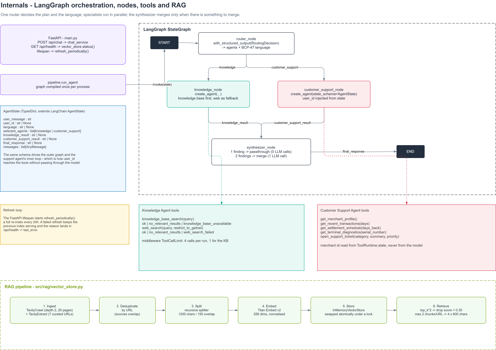
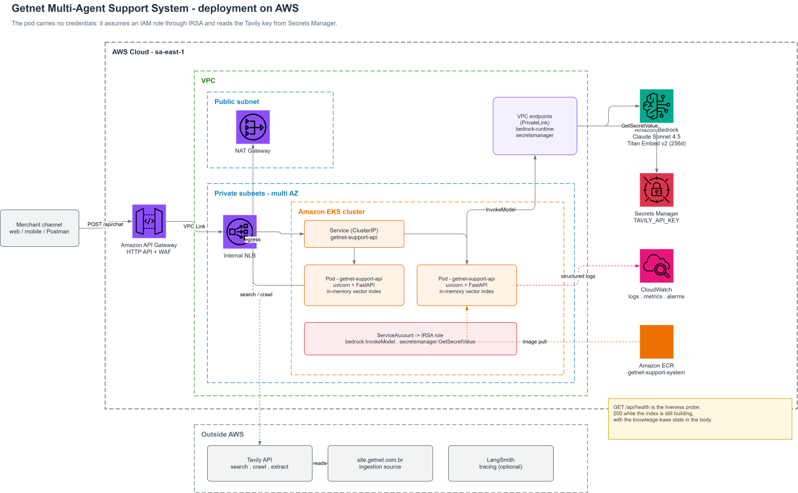

# Getnet Multi-Agent Support System

A support assistant for Getnet merchants ("lojistas"), built as an orchestration of
specialised agents on **LangGraph** + **AWS Bedrock**, exposed through a **FastAPI**
endpoint.

A single HTTP request is classified by a router, dispatched to one or two specialists —
one that answers from an indexed copy of Getnet's Brazilian site plus live web search,
one that reads the authenticated merchant's own data through tools — and merged into a
single reply, written in the language the merchant used.

```json
POST /api/chat
{ "message": "What's the difference between the Get Clássica and the Get Smart?", "user_id": "cliente1988" }

{ "response": "The Get Clássica and Get Smart are two Getnet card machines that differ ..." }
```

---

## Table of contents

- [Quick start](#quick-start)
- [Configuration](#configuration)
- [Running the tests](#running-the-tests)
- [Architecture](#architecture)
- [Message workflow](#message-workflow)
- [Deployment](#deployment)
- [RAG pipeline](#rag-pipeline)
- [Tools](#tools)
- [Design decisions](#design-decisions)
- [Observability](#observability)
- [Reliability and guardrails](#reliability-and-guardrails)
- [Evaluation strategy](#evaluation-strategy)
- [Known limitations](#known-limitations)
- [Project layout](#project-layout)

---

## Quick start

### With Docker (recommended)

```bash
cp .env.example .env          # fill in TAVILY_API_KEY
docker compose up --build -d
curl http://localhost:8000/api/health
```

The container carries **no credentials**. `docker-compose.yml` mounts your `~/.aws`
read-only and passes `AWS_PROFILE`, so boto3 resolves credentials through the standard AWS
chain — exactly as it would from an ECS task role in production.

### Without Docker

```bash
uv sync --extra dev
cp .env.example .env
uv run uvicorn main:app --reload
```

Requires Python >= 3.12 and [uv](https://docs.astral.sh/uv/). On Windows the `make`
targets below have direct `uv run ...` equivalents.

| Make target | What it runs |
| --- | --- |
| `make install` | `uv sync --extra dev` |
| `make hooks` | installs the pre-commit hooks |
| `make lint` | `ruff check` + `ruff format --check` |
| `make fmt` | applies `ruff` fixes and formatting |
| `make test` | the offline test suite |
| `make run` | uvicorn with reload |
| `make docker-up` | `docker compose up --build -d` |

### Endpoints

| Method | Path | Purpose |
| --- | --- | --- |
| `POST` | `/api/chat` | `{message, user_id}` -> `{response}` |
| `GET` | `/api/health` | liveness plus knowledge-base state |
| `GET` | `/docs` | OpenAPI UI |

---

## Configuration

### Credentials

| Variable | Where it lives | Used by |
| --- | --- | --- |
| `TAVILY_API_KEY` | `.env` | web search and site ingestion (read by `langchain-tavily`) |
| AWS credentials | `~/.aws` profile, env vars, or an IAM role | Bedrock chat + embeddings |
| `AWS_PROFILE`, `AWS_REGION` | shell or `docker-compose.yml` | selects profile and region |
| `LANGSMITH_*` | `.env` (optional) | tracing |

`.env` is git-ignored and excluded by `.dockerignore`: no secret ever enters an image
layer. Start from `.env.example`.

The Bedrock models must be **enabled in your AWS account**: the Claude model for chat and
`amazon.titan-embed-text-v2:0` for embeddings — they are granted separately.

### Application settings

Plain Python constants, grouped by concern, with a cached accessor each:

- `src/infra/llm_settings.py` — model ids, region, temperature, token ceiling, embedding
  dimensions.
- `src/infra/knowledge_base_settings.py` — crawl seeds, ingestion cadence, chunking and
  the retrieval parameters (`top_k`, `min_score`, `max_chunks_per_url`, `snippet_chars`).

---

## Running the tests

```bash
make test                 # 51 offline tests, under a second, no network
uv run pytest -m live     # the 10 challenge scenarios against real Bedrock + Tavily
uv run pytest --cov=src   # coverage
```

The offline suite never calls a model or an API: the chat model, the embeddings, the
Tavily client and the CRM repository are all replaced by fakes and fixtures. Tests that
cost money are marked `live` and deselected by default through `addopts`, so a plain
`pytest` can never burn credits by accident.

| File | Covers |
| --- | --- |
| `test_web_search.py` | the six payload shapes Tavily returns, including the raw string that used to crash the API |
| `test_vector_store.py` | score floor, page diversity, deduplication, an index that survives a failed refresh |
| `test_support_tools.py` | the five merchant tools against the seed data, and the refusal to act without an authenticated user |
| `test_graph.py` | routing, language propagation, the synthesis short-circuit, `user_id` travelling in state |
| `test_api.py` | the HTTP contract, `/health` states, the refresh loop starting and stopping with the app |
| `test_tool_budget.py` | the per-run and per-tool call ceilings |
| `test_live_scenarios.py` | the ten scenarios from the challenge statement (marked `live`) |

---

## Architecture

Four nodes on a `StateGraph`, three of them LLM-driven:



**Router Agent** — the only entry point. It never answers; it returns a structured
`RoutingDecision` (`agents`, `language`) produced with `with_structured_output`, so the
plan is a validated Pydantic object rather than text to be parsed. It also decides the
BCP-47 language of the answer from the message itself.

**Knowledge Agent** — answers product and policy questions from the ingested Getnet Brazil
pages, and anything general (weather, exchange rates) from live web search. It is told to
try the knowledge base first and to fall back to the web when retrieval comes back empty.

**Customer Support Agent** — everything that depends on *this* merchant's data. It never
receives the merchant id from the model: the id travels in the graph state and is injected
into the tools at execution time.

**Synthesizer** — merges findings when two specialists ran. When only one ran, it returns
that answer unchanged, with no extra model call (see [Design decisions](#design-decisions)).

Communication between agents is **direct state passing** on the LangGraph state — no
queue, no broker. The state is a `TypedDict` extending LangChain's `AgentState`, which is
what lets the same schema drive both the outer graph and the support agent's inner loop.

---

## Message workflow

```
POST /api/chat
  |- chat_service.handle_chat_request
      |- pipeline.run_agent                 graph compiled once per process
          |- router_node                    1 LLM call -> {selected_agents, language}
          |- knowledge_node                 parallel when both are selected
          |    |- knowledge_base_search / web_search
          |- customer_support_node
          |    |- profile / transactions / settlements / diagnostics / ticket
          |- synthesizer_node               merges, or passes through
```

The state carried between nodes:

| Field | Written by | Read by |
| --- | --- | --- |
| `user_message`, `user_id` | the API request | every node, and the support tools |
| `selected_agents`, `language` | router | conditional edges, agent factories |
| `knowledge_result`, `customer_support_result` | specialists | synthesizer |
| `final_response` | synthesizer | the API response |

---

## Deployment

The repository ships a container and a compose file: `docker compose up --build` is all
the evaluator needs. The diagram below is the **target production topology** the container
was designed for — it is not deployed anywhere today.



Two properties carry over from local to production without a code change:

- **Credentials come from the environment.** Locally, compose mounts `~/.aws` read-only;
  on EKS a ServiceAccount bound through IRSA supplies temporary credentials. The
  application only ever asks boto3's default chain.
- **`/api/health` is the liveness probe.** It answers 200 while the knowledge base is
  still indexing and reports that state in the body, so a slow first crawl never fails a
  rollout.

Both diagrams are generated from a single layout definition:

```bash
python docs/generate_diagrams.py    # -> docs/*.svg and docs/architecture.drawio
```

`docs/architecture.drawio` opens in [app.diagrams.net](https://app.diagrams.net) if you
want to edit them.

---

## RAG pipeline

### Ingestion

Two complementary sources, both through Tavily:

1. **Crawl** — `TavilyCrawl` from `site.getnet.com.br`, depth 2, up to 20 pages.
2. **Extract** — a curated list of seven product pages (`/todas-as-maquininhas/`,
   `/pix/`, `/link-de-pagamento/`, `/crediario/`, `/get-tap/`, `/conta-digital/`,
   `/ofertas/`) that the index must always contain, whatever the crawler discovers.

Results are **deduplicated by URL** — the two sources overlap, and indexing a page twice
skews retrieval. Only the Brazilian site is ingested: `www.getnet.net` is a country picker
whose other locales (uy, ar, cl, mx) answered in the wrong language about products
Brazilian merchants do not have.

### Storage

`RecursiveCharacterTextSplitter` (1200 chars, 150 overlap) -> Bedrock Titan v2 embeddings
(256 dimensions, normalised) -> `InMemoryVectorStore`.

A refresh **builds a whole new index and swaps the reference under a lock**, so no request
ever sees a half-populated index, and a failed refresh leaves the previous one serving.
The loop runs from the FastAPI `lifespan` every `crawl_interval_seconds` (24h by default;
Tavily's free tier is 1,000 credits/month and a crawl costs ~3 credits per 10 pages).

On-demand ingestion, without waiting for the cycle:

```bash
uv run python -m src.rag.vector_store
```

### Retrieval

1. fetch `top_k * 2` nearest chunks by cosine similarity;
2. drop everything below `min_score` (0.35);
3. keep at most `max_chunks_per_url` (2) chunks from the same page;
4. return the first `top_k` (4), each trimmed to 600 characters and carrying its score.

Steps 2 and 3 are the whole difference between a knowledge base that helps and one that
misleads — see below.

### Generation

The agent grounds every claim in retrieved content, quotes figures only when a source
states them, attributes them to `site.getnet.com.br`, and ends with a `Fontes:`/`Sources:`
line listing the URLs it actually used. Prompts live in `src/prompts/templates.py` and
carry a `PROMPT_VERSION` that changes with any edit, so a traced run can be tied to the
exact prompt that produced it.

---

## Tools

**Knowledge Agent**

| Tool | Returns |
| --- | --- |
| `knowledge_base_search` | scored snippets from the index; `no_relevant_results` or `knowledge_base_unavailable` otherwise |
| `web_search` | Tavily results, optionally restricted to Getnet's Brazilian domains |

**Customer Support Agent** (all read the merchant from the graph state)

| Tool | Returns |
| --- | --- |
| `get_merchant_profile` | plan, MDR rates, bank account, registered terminals |
| `get_recent_transactions` | approved and declined sales in a window |
| `get_settlement_schedule` | per-transaction credit dates, gross vs net, and the rule applied |
| `get_terminal_diagnostics` | live device state: connectivity, signal, firmware, 24h error codes |
| `open_support_ticket` | creates a back-office ticket and returns its id |

Merchant data is served by an in-process repository seeded from
`src/tools/seed_merchants.json`, behind a `get_repository()` / `set_repository()` seam so
tests can swap it. Every tool returns JSON with an explicit `status`/`error` field rather
than raising, so a failure becomes something the model can reason about instead of a 500.

---

## Design decisions

**The tools' contract is a status, not a payload.** Every tool answers with `ok`,
`no_relevant_results`, `knowledge_base_unavailable`, `web_search_failed` or
`tool_failure`. The prompts are written against those statuses, which is what makes the
fallback from knowledge base to web search a rule instead of a hope.

**Retrieval needs a confidence floor.** A vector store always returns its *k* nearest
chunks, however irrelevant. Measured on real questions, off-topic pages scored
**0.29-0.31** while correct Getnet Brazil content scored **0.40-0.57**; the floor sits at
0.35, in the gap. Below it the tool answers `no_relevant_results` and the agent goes to
the web — instead of reformulating the same question over and over against noise.

**Diversity beats raw ranking.** Without a per-page cap, the pricing page took every slot
and the answer missed the technical comparison that lived on another page. Two chunks per
URL, at most.

**Tool budgets are enforced in code.** A prompt asking for "one lookup" is a suggestion;
`ToolCallLimitMiddleware` is a guarantee — one `knowledge_base_search` and four tool calls
per run. Blocked retries count against the global budget, which is why it is 4 and not 2:
a tighter cap let a stubborn agent eat its own web-search fallback.

**One specialist means no synthesis round trip.** The synthesizer used to run on every
request; for single-agent questions it added a full model call *and* rewrote a good answer
into a deflection. It now returns the single finding unchanged.

**The merchant id never passes through the model.** It travels in the graph state and is
read by `_authenticated_user_id(runtime)` at tool execution. The support prompt states the
identity is already authenticated and must never be requested.

Together, these took the reference question from **9 model calls and ~35s** to **3-4 calls
and ~9s**, answered from the index instead of the open web.

---

## Observability

- **`GET /api/health`** reports the knowledge base as an operator sees it: `ready`,
  `refreshing`, `started_at`, `pages`, `chunks`, `last_refresh`, `last_error`. It is
  liveness, not readiness — the API answers 200 while indexing, and says so in the body.
- **Structured application logs** through `src/infra/logger.py`: every question and
  merchant id, every refresh (`crawled N pages from ...`, `extracted N of 7 listed pages`,
  `knowledge base indexed: N pages, M chunks`), and **every retrieval hit with its score**
  (`kb_hit score=0.533 url=...`) — the raw material for calibrating `min_score`.
- **Failures are logged, never swallowed silently**: crawl and extract errors land both in
  the log and in `last_error` on `/api/health`.
- **LangSmith tracing** is one variable away (`LANGSMITH_TRACING=true`), giving per-node
  latency, token usage and the full tool-call tree.

---

## Reliability and guardrails

- Every external call is wrapped: Tavily failures, empty results and malformed payloads
  become a JSON status the agent can act on. A crawl that returns nothing keeps the
  previous index.
- The support tools translate `MerchantNotFoundError` into `merchant_not_found` and any
  other exception into `tool_failure`, never a stack trace to the user.
- The router is constrained by a structured schema, so it cannot invent an agent that does
  not exist.
- Tool-call ceilings bound both latency and cost per request.
- `INPUT_GUARDRAIL_PROMPT` (prompt-injection, harmful requests, self-harm, credential
  sharing, PII redaction) is written and **not yet wired** — see
  [Known limitations](#known-limitations).

---

## Evaluation strategy

What exists today:

- **51 offline tests** as the regression floor. Each production bug found during
  development became a test — the Tavily string payload, the missing lifespan, the
  synthesis deflection, the tool-call storm.
- **11 `live` tests** covering the ten scenarios from the statement, runnable on demand
  against real infrastructure.

What I would add next, in order:

1. **A golden dataset** of question -> expected sources and expected route, run in CI
   against recorded fixtures — catching routing regressions without paying for tokens.
2. **Retrieval metrics** — precision@k and the score distribution per query class, using
   the `kb_hit` logs already emitted. That turns `min_score` from a judgement call into a
   measured threshold.
3. **LLM-as-judge on faithfulness**: given the retrieved chunks and the answer, does every
   claim have support? Run over the golden set, tracked per `PROMPT_VERSION`.
4. **Production monitoring** on p95 latency per node, tool-call count per request,
   `no_relevant_results` rate (a rising rate means the index is drifting from what people
   ask) and Bedrock throttling.

---

## Known limitations

- **The index lives in memory.** A restart re-indexes from scratch, and multiple replicas
  would each keep their own copy. A persistent store (pgvector, OpenSearch) is the natural
  next step.
- **The guardrail node is not wired.** The prompt exists; the graph does not use it.
- **No human escalation agent.** `open_support_ticket` covers the hand-off, but there is
  no dedicated escalation node.
- **The crawler contributes little.** In practice the curated extract list carries the
  index; crawling `site.getnet.com.br` yields few additional usable pages.
- **The API is unauthenticated** and trusts `user_id` in the body — acceptable for the
  exercise, not for production, where the id would come from a verified token.
- **Single process, no persistence.** No conversation memory between requests: each call
  is stateless.

---

## Project layout

```
main.py                      FastAPI app, lifespan that keeps the index fresh
src/
  api/                       router and request/response models
  services/                  entry point for the chat use case
  agents/
    graph.py                 the StateGraph: nodes and edges
    nodes.py                 the four nodes and the agent factories
    state.py                 shared state + the router's structured decision
    pipeline.py              compiles the graph once and runs it
  rag/vector_store.py        ingestion, index, retrieval
  tools/
    knowledge_base.py        knowledge_base_search, web_search
    customer_support.py      the five merchant tools
    crm.py                   in-process merchant repository
  prompts/templates.py       every prompt, versioned
  infra/                     settings and logging
  llm/llm.py                 the Bedrock chat model factory
docs/                        architecture diagrams, generated by generate_diagrams.py
tests/                       51 offline tests + 11 live scenarios
Dockerfile                   multi-stage build, non-root runtime, healthcheck
docker-compose.yml           port, .env and the read-only AWS profile mount
```
